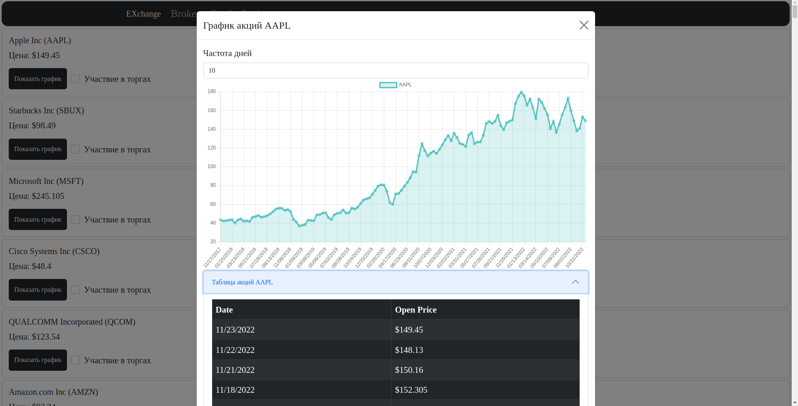

# brokerage-site
Realization of small web-exchange platform.
## Admin
+ Backend-server for whole app.
+ + NestJS + TypeScript
+ + Web-Sockets: NestJS Websockets
+ + Data: JSON
+ Frontend for administration module.
+ + React + JavaScript
+ + UI: React-Bootstrap
+ + Charts: Chart.js
+ + Stores: Redux
+ + Web-Socket: SocketIO
    
    
    
    
## User
+ Frontend for brokers module.
+ + Vue.js
+ + UI: Bootstrap
+ + Tests: Puppeteer
+ + Charts: Chart.js
+ + Stores: Vuex
    
    
